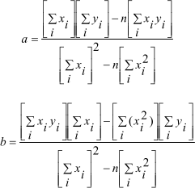

# Método-dos-mínimos-quadrados-(MMQ)

Este projeto apresenta um método matemático muito eficiente na análise de dados, 
e que será apresentado aqui para resolver problemas de ajuste linear de forma direta e 
também linearizada. 
No final apresentaremos uma aplicação de um fenômeno físico observacional o pêndulo simples.

Objetivo:

Aprender o método dos mínimos quadrados para ajustes de retas.

O método dos mínimos quadrados apresentado aqui, visa obter o ajuste de retas para medidas sujeitas a erros aleatórios.
Sendo um ajuste de reta, o objetivo do método é encontrar os coeficientes angular (a) e linear (b) da função que descreve a reta. 

  

  

**Função Linear**

A função linear pode ser definida por:

y=ax +b

onde,

y e x: variáveis

a e b: Coeficiente angular e linear

**Função Potencial**

$y =kx^n$

k e n: constantes

**Exemplo de uma função potencial - Aplicação pêndulo físico**

$T=2 \pi \sqrt{L/g}$
